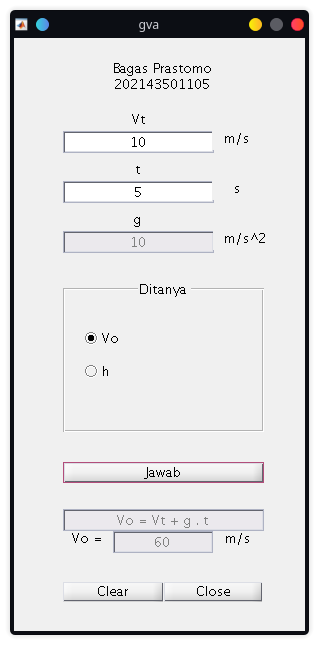

# Kalkulator Gerak Vertikal ke Atas

  Sebuah program yang dibuat untuk mengkalkulasikan hasil dari sebuah pertanyaan tentang Gerak Vertikal ke Atas yang dibuat dengan Matlab.

## Algoritma Yang Digunakan

  User menginput variabel berupa Vt (kecepatan benda saat t sekon) dan variabel t (waktu tempuh). Kemudian program akan mengkalkulasikan hasil dari jawaban sesuai dengan input dari radiobutton (V0 atau h). dengan rumus V0 = Vt+g*t dan h = V0*t-(1/2)*g*t^2

## User Interface dan Keterangan Tag
### User Interface

 </a>

### Keterangan Tag

#### Static Text and Textbox

 Vt Textbox = vt 

 t Textbox = t 

 g Textbox = g 

 Hasil Textbox = hasil 

 Rumus Textbox = rumus 

 StaticText1 = aa 

 StaticText2 = bb 

#### Buttons

 Vo Radiobutton = vawal 

 H Radiobutton = tinggi 

 Jawab Pushbutton = jawab 

 Clear Pushbutton = clear 

